Breadcrumb
[下載連結點](https://developer.apple.com/library/ios/samplecode/Breadcrumb/Introduction/Intro.html#//apple_ref/doc/uid/DTS40010048) 
起始畫面點ＯＫ後進入第二張圖
 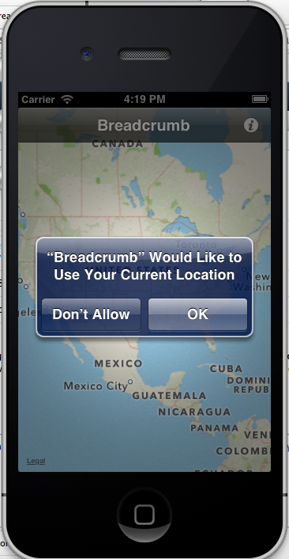 
點兩下可拉近，按住可以左右移動地圖
 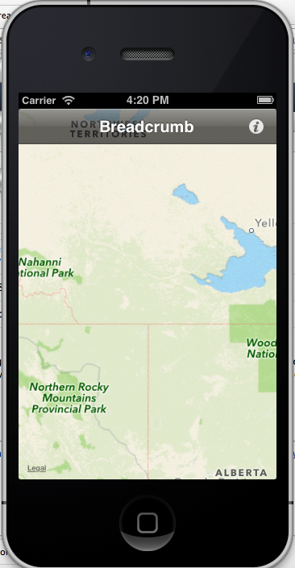 
點右上角的按鈕會跳出選擇扭
 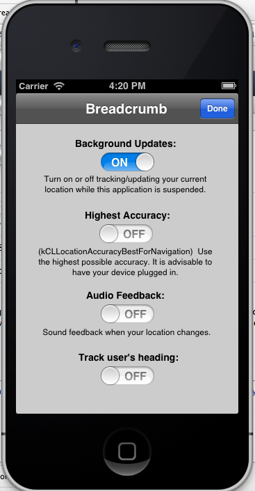 
按done返回
  
點左下角的灰色連結Legal會跳出下一張圖
 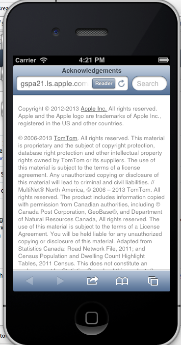
 點選上面功能列會跳出鍵盤
 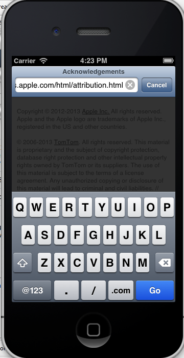
 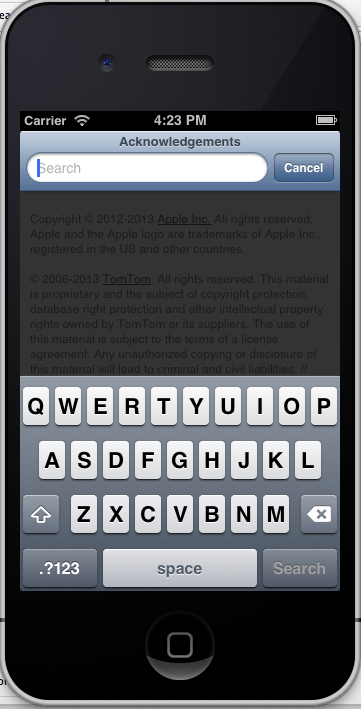
 下面三個按鈕如下面三張
# 第三個按鈕
 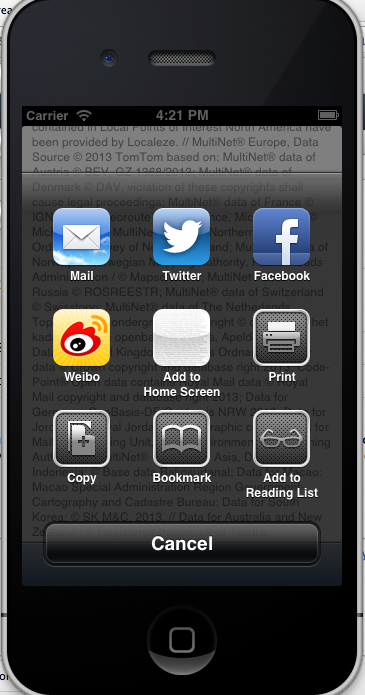
 點Ｅ-mail按鈕
 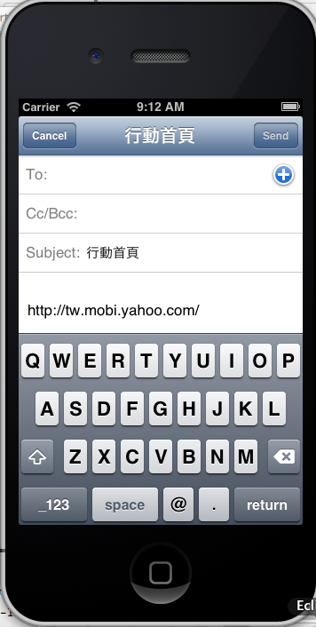
 點Twitter按鈕
 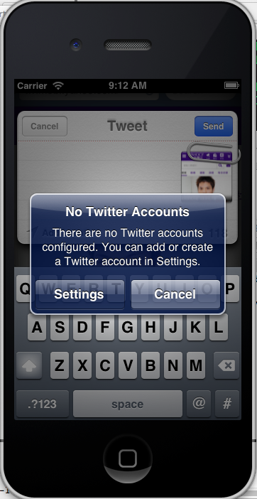
 其他按鈕還有動作沒有拍圖

# 第四個按鈕
 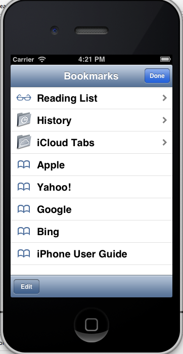
 點Edit可以新增及刪除
 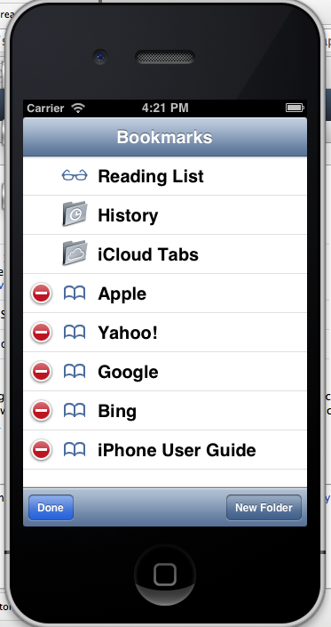
 裡面的功能點進去的圖
 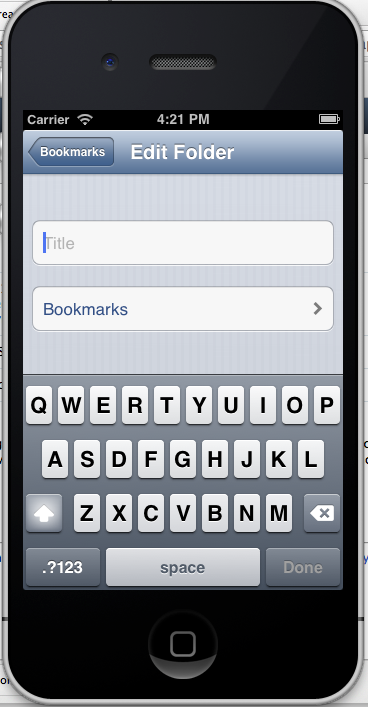

# 第五個按鈕網頁瀏覽
 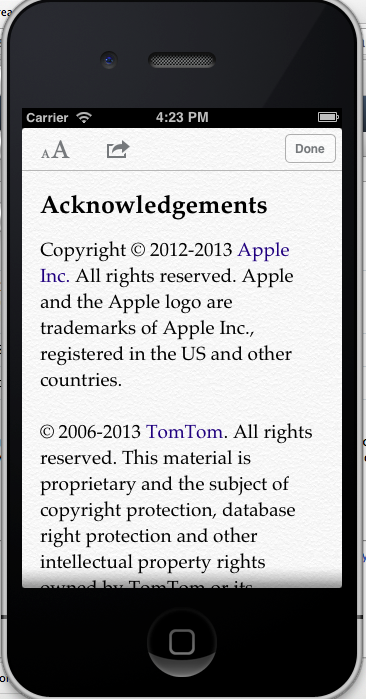
 點New Page可開新分頁
 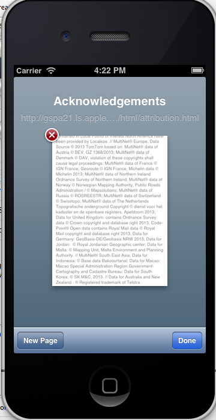

