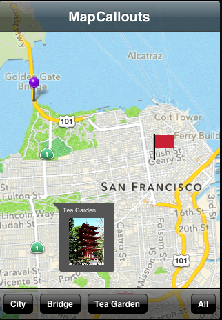
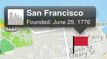
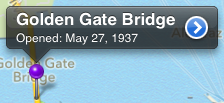
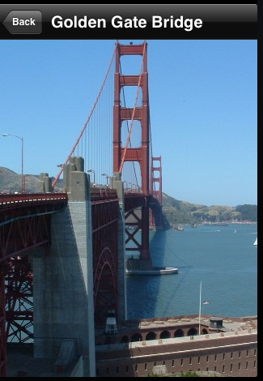
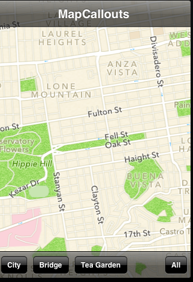

MAP CALLOUTS
==========

 * 可以在地圖上設不同的類別(這裡有三個City, Bridge, Tea Garden)
 * 並有不同的顯示方式(大頭針、旗幟、圖片)，也可以全部同時顯示出來(All)
 * 這畫面是選擇一起顯示(All)

點選旗幟圖可以看到圖片、標題和副標

 

點選大頭針可看到標題、副標和延伸頁(下一張)

 

這是大頭針的延伸頁，可以放實景照

 

此地圖也具有縮放功能

 
