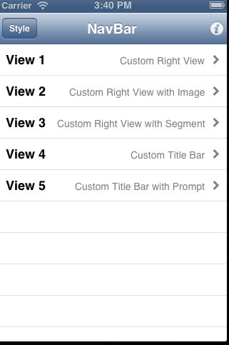
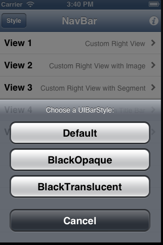
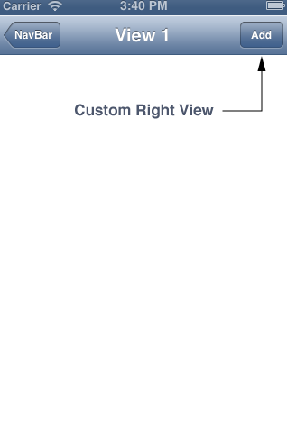
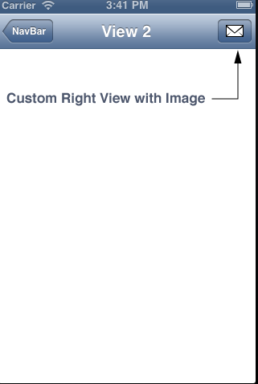
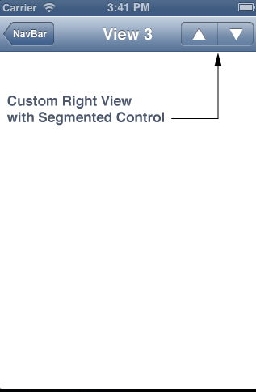
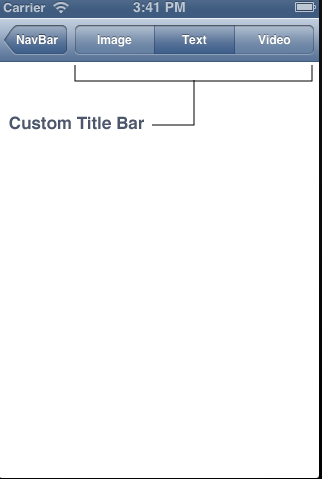
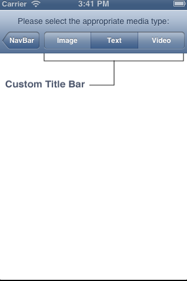

NavBar
======

首頁，可以有5種不同方法的navBar
 * 自訂右按鈕
 * 自訂右按鈕並用圖示顯示
 * 可到上頁或下頁的按鈕
 * 可自訂標題欄位
 * 可自訂標題欄位
 * 右邊的i鍵只是說明作者是誰
 * 左邊的style鍵可以更換navBar的顏色樣式(下一張)

可以自己設定不同的樣式
這裡是預設(藍色)、黑色和灰色

 

1.自訂右按鈕

 

2.自訂右按鈕並用圖示顯示

 

3.可到上頁或下頁的按鈕

 

4.可自訂標題欄位

 

5.可自訂標題欄位

 

全部圖片皆取自apple developer!!
