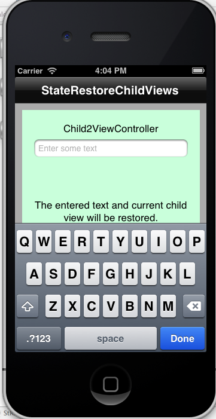

 StateRestoreChildViews
 [下載連結點](https://developer.apple.com/library/ios/samplecode/StateRestoreChildViews/Introduction/Intro.html#//apple_ref/doc/uid/DTS40013492)
 打開有輸入方塊的text點即可出現鍵盤
 
 點擊child1 或child2可以像下面兩張圖變色
 
 

