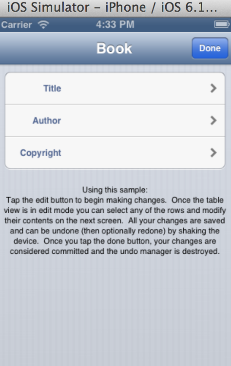
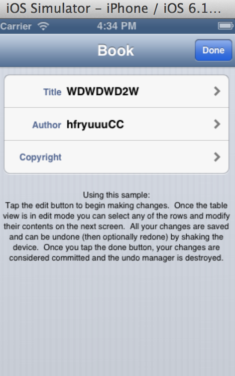
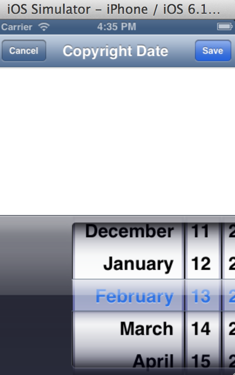

 
有個Table view 可以編輯共有三列Title、Author、Copyright。
 
按下Edit鍵可以各自進行編輯。
 
改Title的畫面。
 
改完後按Save鍵後回來的主畫面。
 
Author的編輯畫面。
 
一樣按Save之後的主畫面。
 
Copyright Date的編輯畫面他是以PICKER的方法下去做編輯的。
 
按完Save的主畫面最後按下Done鍵就會做儲存。
